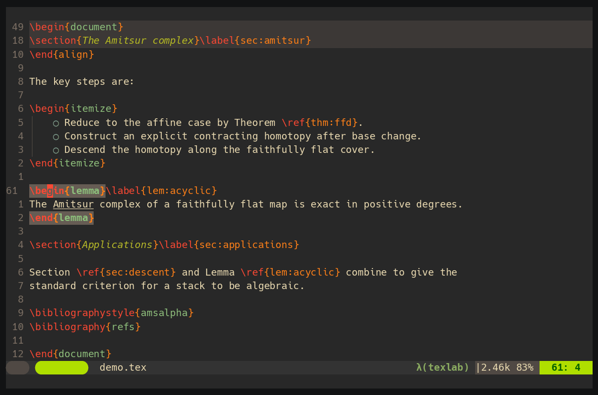
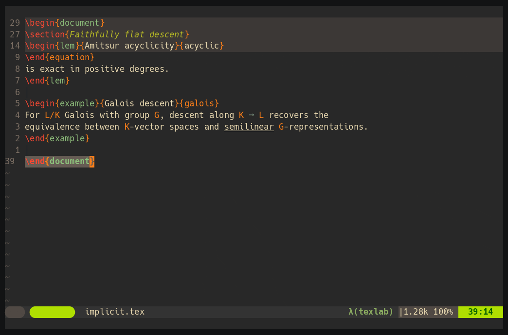
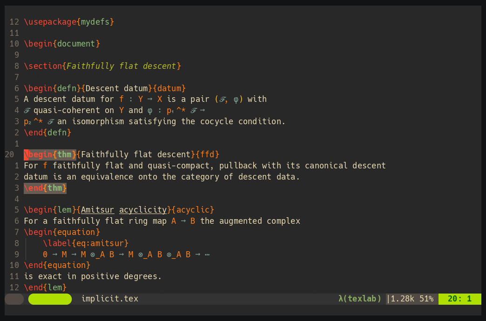
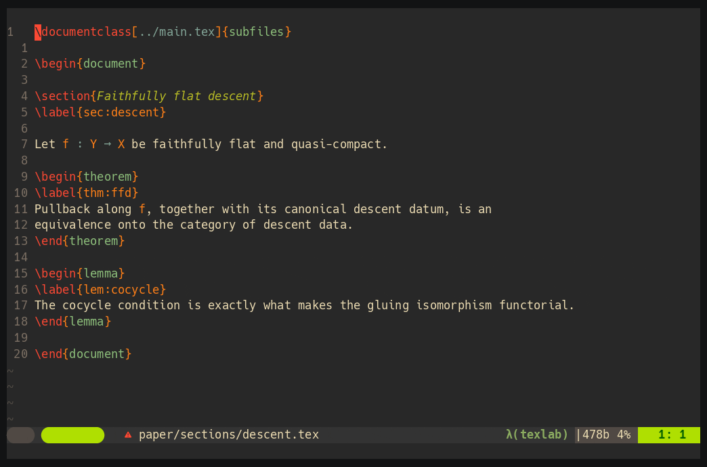

# snacks-latex-labels.nvim

A [Snacks.nvim](https://github.com/folke/snacks.nvim) picker for fast LaTeX
label navigation. This is the Snacks-native companion to
[telescope-latex-labels.nvim](https://github.com/Chiarandini/telescope-latex-references).

Both plugins share the same on-disk cache, so the project is only scanned once
regardless of which picker you open first.



## Dependencies

| Plugin | Role |
|---|---|
| [folke/snacks.nvim](https://github.com/folke/snacks.nvim) | Picker UI |
| [Chiarandini/latex-nav-core.nvim](https://github.com/Chiarandini/latex-nav-core.nvim) | Shared cache utilities and Snacks factory |
| [Chiarandini/telescope-latex-references](https://github.com/Chiarandini/telescope-latex-references) | Cache I/O, scanner, and smart-jump utilities |

## Installation

**lazy.nvim**

```lua
{
  "Chiarandini/snacks-latex-labels.nvim",
  dependencies = {
    "folke/snacks.nvim",
    "Chiarandini/latex-nav-core.nvim",
    "Chiarandini/telescope-latex-references",
  },
  config = function()
    require("snacks_latex_labels").setup({
      -- all keys are optional; defaults shown below
      cache_strategy    = "global",
      recursive         = true,
      auto_update       = false,
      enable_smart_jump = true,
      smart_jump_window = 200,

      root_file          = "",
      subfile_toggle_key = "<C-g>",
      copy_label_key     = "<C-y>",
      copy_transform     = nil,

      transformations = {
        thm = "th:", prop = "pr:", defn = "df:",
        lem = "lm:", cor = "co:", example = "ex:", exercise = "x:",
      },
    })
  end,
}
```

## Usage

The plugin registers the following user commands:

| Command | Effect |
|---|---|
| `:SnacksLatexLabels` | Open the labels picker for the current project. |
| `:SnacksLatexLabelsExport` | Export labels (key=value form or interactive UI; see below). |
| `:LatexLabels update` | Regenerate the cache for the current project's root. |
| `:LatexLabels inspect` | Open the on-disk cache file in a read-only split. |
| `:LatexLabels wipe` | Delete every cache file under `cache_strategy`. |

Or map the picker:

```lua
vim.keymap.set("n", "<leader>fl",
  "<cmd>SnacksLatexLabels<cr>",
  { desc = "Find LaTeX labels (Snacks)" })
```

The picker behaviour is identical to the Telescope version:

- **Enter** — smart jump to the label (verifies position, auto-patches cache if shifted)
- **`<C-y>`** — copy the label id to the system clipboard (with optional `copy_transform`)
- **`<C-g>`** — subfile toggle (full project ↔ this file) when editing a subfile

## Implicit labels

`patterns` has two entries. The first is what makes custom theorem environments
work:

```lua
{ pattern = "\\begin{(%w+)}{(.-)}{(.-)}", type = "environment" }
```

Some environments issue their own `\label` from an argument, so no `\label{...}`
is written in the document at all. Given `\begin{thm}{Title}{key}` that expands
to a `\label{th:key}`, the scanner takes the environment name and the third
brace group and rebuilds the id as `transformations[env] .. key`, with the title
as the picker's context. Environments missing from `transformations` are
skipped.



The second pattern is the ordinary `\label{...}`. Its context cannot come from
the label itself, so the scanner looks back up to eight lines for the first
non-blank, non-comment line and takes its first brace group, else its first
bracket group, else the command name.

## Copying a reference

`<C-y>` copies a reference to the label rather than the label id.
`copy_transform` dispatches on the prefix: the first prefix the id starts with
wins, and its value is a format string receiving the whole id.

```lua
copy_transform = {
  ["th:"] = "\\cref{%s}",
  ["lm:"] = "\\cref{%s}",
  ["df:"] = "\\cref{%s}",
  ["ex:"] = "example~\\ref{%s}",
  ["eq:"] = "equation~\\eqref{%s}",
}
```

So `<C-y>` on `th:ffd` gives `\cref{th:ffd}` and on `eq:amitsur` gives
`equation~\eqref{eq:amitsur}`. The text goes to both `+` and `"`.



A function is accepted for anything a prefix table cannot express.
`copy_transform` defaults to `nil`, which copies the bare id. NoetherVim's
`latex` bundle ships the map above.

## Main file and subfiles

The picker scans the project root, not the buffer. The root comes from
`b:vimtex.tex` when vimtex is loaded, otherwise from walking up through
`\documentclass[<relative-path>]{subfiles}` in the first 20 lines, and finally
from `root_file`. With `recursive = true` the scan follows `\include`, `\input`,
and `\subfile`, so labels in a sibling section are listed while you edit a
different one, and Enter opens that file.



`<C-g>` toggles the scope between the whole project and the current file. The
picker title states which view is active.

## Configuration

All options are identical to
[telescope-latex-labels.nvim](https://github.com/Chiarandini/telescope-latex-references#configuration-reference).
If you use both pickers, pass the same table to both `setup()` calls to ensure
they share the same cache.

## Label Export

Export the current project's labels to JSON, CSV, TSV, or plain text with
`:SnacksLatexLabelsExport`. With no arguments, three sequential prompts guide
you through the format, output path, and path style. Every prompt can be
bypassed by passing `key=value` arguments on the command line.

```
:SnacksLatexLabelsExport [key=value ...]
```

Use `!` (bang) to force the full interactive UI regardless of any arguments:

```
:SnacksLatexLabelsExport!
```

### Arguments

| Argument | Values | Description |
|---|---|---|
| `format=` | `json` `csv` `tsv` `txt` | Output format; skips the format prompt |
| `path=` | any path | Output file or directory; skips the path prompt. `~`, `$VAR`, relative paths, and directories (default filename appended) are all accepted |
| `relative=` | `true` `false` | Path style; skips the path-style prompt |
| `line=` | `true` `false` | Include/omit line numbers (overrides config) |
| `title=` | `true` `false` | Include/omit label titles (overrides config) |
| `file=` | `true` `false` | Include/omit file paths (overrides config) |
| `exclude=` | `pat1,pat2,...` | Lua patterns — labels whose filename matches are omitted |

Tab-completion is available for all arguments.

### Examples

```vim
" Interactive — all three prompts
:SnacksLatexLabelsExport

" Silent JSON export to the project root
:SnacksLatexLabelsExport format=json path=. relative=false

" Minimal CSV — IDs and titles only
:SnacksLatexLabelsExport format=csv line=false file=false path=~/labels.csv

" Exclude archived files from the export
:SnacksLatexLabelsExport format=json exclude=archive,backup
```

### Export configuration

These keys can be set in `setup()` to provide defaults that the export command
uses when the corresponding argument is not supplied:

| Option | Type | Default | Description |
|---|---|---|---|
| `export_include_line` | `boolean` | `true` | Include line numbers in exported records |
| `export_include_title` | `boolean` | `true` | Include label titles in exported records |
| `export_include_file` | `boolean` | `true` | Include file paths in exported records |
| `export_use_relative_paths` | `boolean` | `false` | Use paths relative to project root |
| `export_exclude_files` | `table` | `{}` | Lua patterns — matching filenames are excluded |

## Shared cache

Both this plugin and `telescope-latex-labels.nvim` call
`latex_nav_core.cache.get_cache_path` with the same arguments, so they resolve
to the exact same `.labels` file. The project is scanned only on the first open,
whichever picker triggers it.
